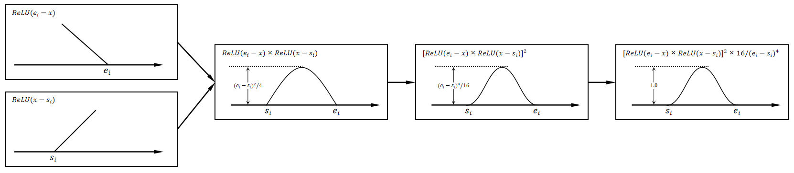
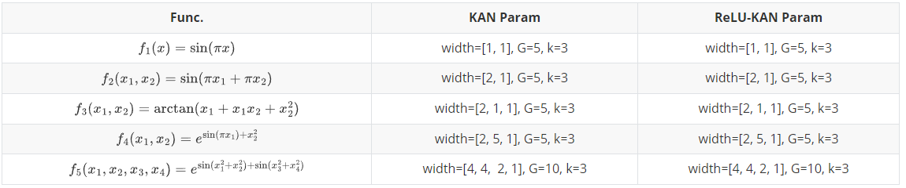
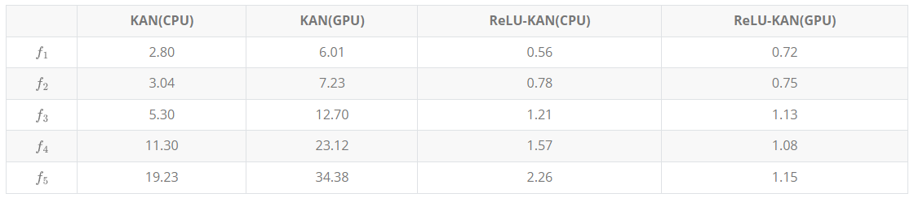
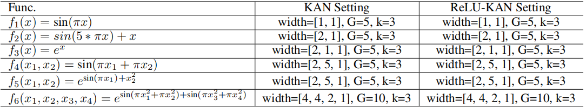
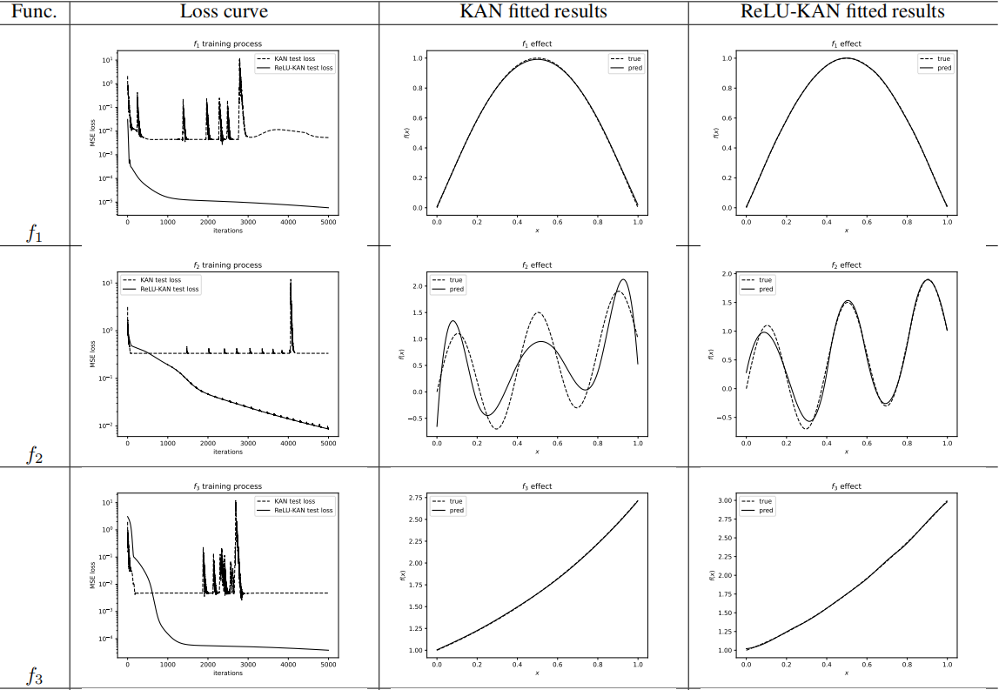
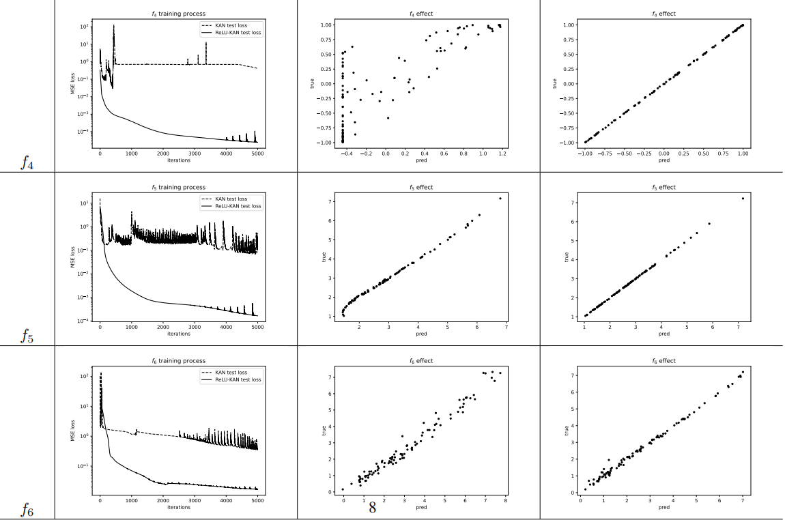

# ReLU KAN

> (English)Abstract: We implemented a simpler KAN network with no more 
> than 30 lines of core code, but 20 times faster and 
> two orders of magnitude more accurate than the original KAN.

We use the simpler function $R_i(x)$​ to replace the B-spline function in KAN as the new basis function:

$$
R_i(x) = [\text{ReLU}(e_i - x)\times \text{ReLU}(x-s_i)]^2 \times 16 / (e_i - s_i)^4 \tag{6}
$$

where, $\text{ReLU}(x) = \text{max}(0, x)$.

Like $B_i(x)$, $R_i(x)$ is also a unary bell-shaped function, 
which is nonzero at $x \in [s_i, e_i]$and zero at other intervals. 
The $\text{ReLU}(x)$ function is used to limit the range of nonzero values, 
and the squaring operation is used to increase the smoothness of the function. 
$16 / (e_i - s_i)^4$ for normalization. As next:

Based on this, defining a convolutional operation $C$ with one input channel, 
$n$ output channels, and a kernel size of $m \times (G+k)$,
we can turn the whole training process of KAN into a complete matrix operation process.

$$
\boldsymbol{x}_1 = ReLU(\boldsymbol{e} - \boldsymbol{x})\\
\boldsymbol{x}_2 = ReLU(\boldsymbol{x} - \boldsymbol{s})\\
\boldsymbol{x}_3 = r\times \boldsymbol{x}_1 \cdot \boldsymbol{x}_2\\
\boldsymbol{x}_4 = \boldsymbol{x}_3 \cdot \boldsymbol{x}_3\\
\boldsymbol{y} = C(\boldsymbol{x}_4)
$$

We compare the training speed before and after improvement on five functions:

On CPU and GPU, the training time of both is shown in the following table:

We conducted fitting experiments on the following six functions, 

and the fitting results are shown in the following table

The new KAN can similarly avoid catastrophic forgetting

## Quick Start

Run `fitting_example.py` You can see an example of ReLU-KAN fitting a unary function.

`exp_speed.py`: Experimental code for speed.

`exp_fitting.py`: Experimental code for fitting ability.

`catastrophic_forgetting.py`: Experimental Code against Catastrophic Forgetting.

